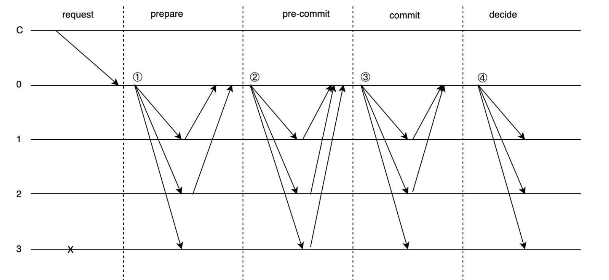
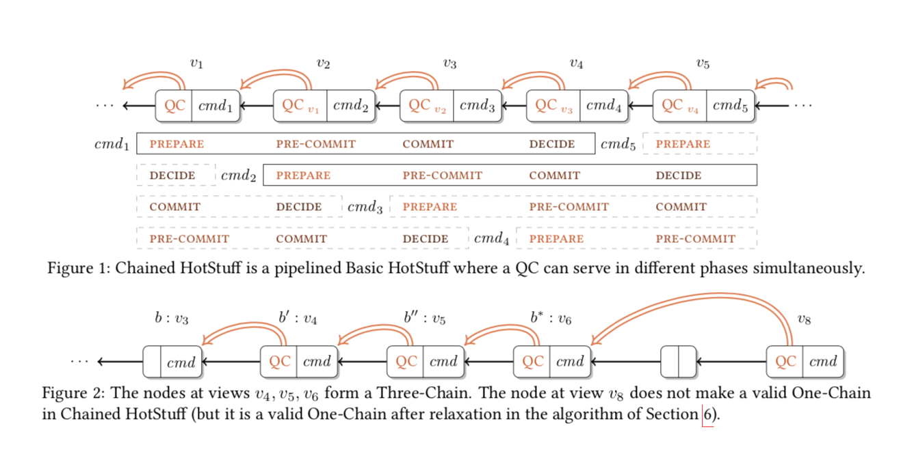
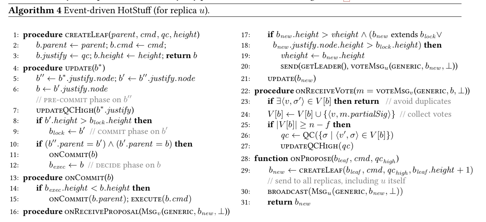
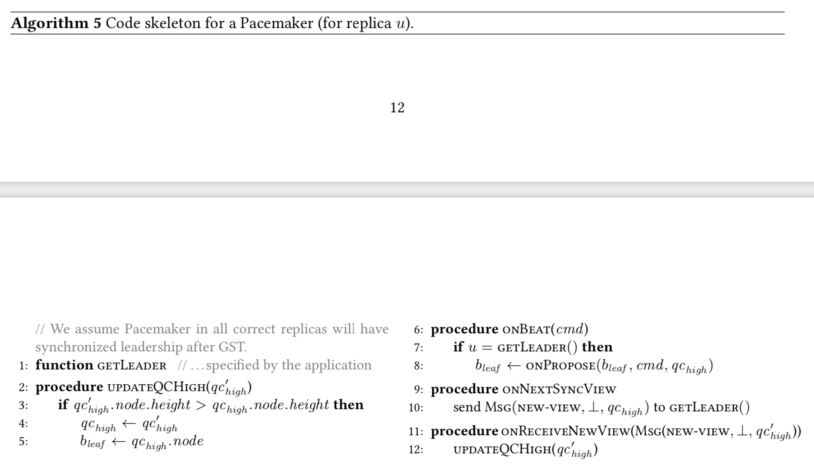
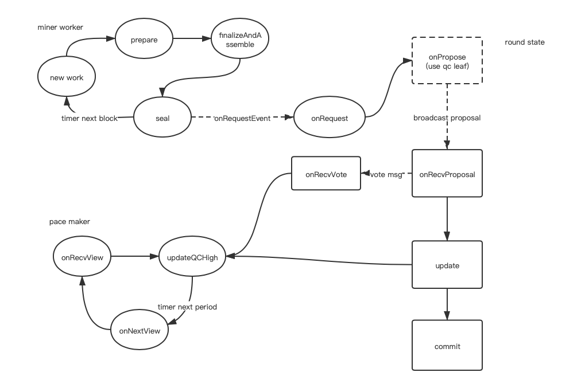

## event-dirve hotstuff protocol
event-dirve-hotstuff共识协议实现并接入以太坊.hotstuff采用4阶段3轮投票的方式，前两个阶段与pbft类似，实现对资源的确认，最后两轮确认并落账。
hotstuff的通讯采用主从模式，网络复杂度是线性的O(n)。


#### 流水线
event-dirve hotstuff实现了流水线处理，如下图所示，v4 prepare阶段同时需要处理来自v3的pre-commit，v2的commit以及v1的decide


#### 算法论文及流程
论文中描述的algorithm4&algorithm5如下，



结合以太坊矿工工作流程，我们可以以此得到如下流程图


1.miner worker
* newWork: 以太坊矿工worker通过newWorkLoop内闭包commit及定时器实现挖矿的定时处理
* prepare: 根据worker当前高度及parent hash构造新的区块头(主要是判断共识引擎是否能从chainReader中读取parentBlock以及设置新一轮的valset)
* finalizeAndAssemble: 将矿工worker applyTransactions得到的txs&receipts&logs打包到block
* seal: 检查parentHash以及proposer(是否在validators中)，proposer对区块签名，然后通过发送请求到共识引擎触发新一轮的propose

2.paceMaker<br>
paceMaker作为event-drive hotstuff协议中保证活性的模块，本身作为一个独立的功能模块运行，内置定时器，定时触发onNextView，发送newView消息
* onNextView: 区块高度+1，将之前接收到的highQC及消息类型打包成p2p消息单播给新一轮的leader
* onRecvNewView: leader的paceMarker接收到(n - f)或者(2f + 1)个newView，找到其中viewNumber最大的一个最为hiqhQC调用updateQCHigh 
* updateQCHigh: 判断参数qc高度是否大于当前highQC,如果是则更新qc，并将qc携带的blockHash作为状态机bLeaf

3.roundState
状态机，内置bLeaf,bLock,bExec, 其中bLeaf是本轮可能更新的区块，bLock是经过安全性以及活性证明后锁定的区块，bExec是最终落账的区块<br>
此外，状态机需要维护一个历史高度vheight
* onPropose: 使用updateHighQC得到的bLeaf以及miner worker seal的block构建一个新的proposal，并广播
* onRecvProposal: 在确定proposal高度vheight且满足safeNode条件后更新vheight为新的proposal高度，单播投票，进入update
* onRecvVote: leader节点收集并去重后，确认得到(n - f)或者(2f + 1)个投票信息后将签名聚合成qc，并再次更新updateHighQC
* update: 参数为新的b*，查询b*的parent b''是否存在,存在则证明b''作为上一轮共识的pre-commit step是ok的，可以更新b''的updateQCHigh,<br>
查询b''的parent b'是否存在，如果存在，则证明b'作为上上轮共识的commit step是ok的，可以将区块b'锁定为bLock，<br>
查询b'的parent b是否存在，如果存在，则证明b作为3轮前共识的decide阶段是ok的，可以将区块b落账
* commit: 沟通worker，将需要落账的区块通过通道返回给矿工，需要注意的是，共识的高度应该要比矿工的高度高，差值为3。
 
4.safeNode条件
safety rule: qc携带的block继承于bLock
liveness rule: qc高度大于bLock高度

#### 消息类型
共识内部消息以及p2p消息类型
```dat
consensusMsgType newView = 1
                 prepare = 2
                 vote    = 3

p2pMsgNewBlock = 0x06
p2pMsgHotstuff = 0x11
```

* 广播消息:

QuorumCert 
```dat
{
    BlockHash       Hash
    BlockHeight     uint64
    AggragateSig    []byte      // 对blockhash的聚合签名或者多签extra, signer从最近的N个块中寻找
}
```

MsgNewView 
```dat
{
    QC      QuorumCert
    NewView MsgType  
}
```

MsgPrepare 
```dat
{
    Block Block
}
```

MsgVote 
```dat
{
    BlockHash Hash
    Signature []byte
}
```
Message: 发送给其他节点的p2p消息(消息处理成payload发送)
```dat
    MsgType     uint
    Payload     []byte     
    Signature []byte
```

MsgProposal: 应该包含block
MsgVote: 应该包含block hash, block number, signature

* 内部消息:
HotstuffRequest: 从miner/worker seal时，将block打包到request中发送给共识引擎, 用pubsub去做
NextRound: 由paceMaker触发

#### valset
* 存储每个block对应的valset(后面再持久化)
* 对valset排序
* roundrobin算法(后面再改进)

#### paceMaker

#### 空块的处理, 需不需要changeView

#### 信号触发的问题
nextView

#### 