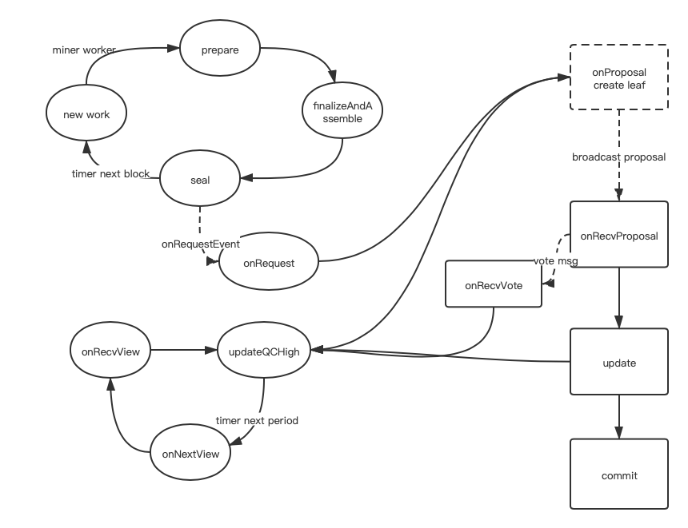

## hotstuff protocol
this package implemented event-drive-hotstuff protocol.

#### 消息类型
* 广播消息: 
```dat
MsgNewView {

}
```
MsgProposal: 应该包含block
MsgVote: 应该包含block hash, block number, signature

* 内部消息:
HotstuffRequest: 从miner/worker seal时，将block打包到request中发送给共识引擎, 用pubsub去做
NextRound: 由paceMaker触发

#### valset
* 存储每个block对应的valset(后面再持久化)
* 对valset排序
* roundrobin算法(后面再改进)

#### 状态机


1.miner worker
* newWork: 以太坊矿工worker通过newWorkLoop内闭包commit及定时器实现挖矿的定时处理
* prepare: 根据worker当前高度及parent hash构造新的区块头(主要是判断共识引擎是否能从chainReader中读取parentBlock以及设置新一轮的valset)
* finalizeAndAssemble: 将矿工worker applyTransactions得到的txs&receipts&logs打包到block
* seal: 检查parentHash以及proposer(是否在validators中)，proposer对区块签名，然后通过发送请求到共识引擎触发新一轮的propose

2.paceMaker
paceMaker作为event-dirve hotstuff协议中保证活性的模块，本身作为一个独立的功能模块运行，内置定时器，定时触发onNextView，发送newView消息
* onNextView: 区块高度+1，将之前接收到的highQC单播给新一轮的leader

#### paceMaker

#### 空块的处理, 需不需要changeView

#### 信号触发的问题
nextView

#### 